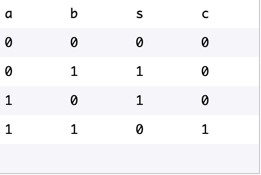
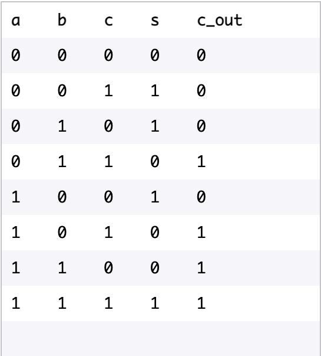

<h1> Adder Circuit Simulation </h2>

The Adder is part of an Arithmetic Logic Unit (ALU).

A full adder is normally comprised of *two half* adders. A half adder takes in two inputs, `a` and `b`, and returns a sum bit, `s`, and a carry bit, `c`. 

Half Adder Truth Table: 

    

Truth Table Full Adder takes in `a`, `b`, and a carry-in bit `c`. It returns a sum bit `s` and a carry-out bit `c_out`. 

Full Adder Truth Table: 

    

